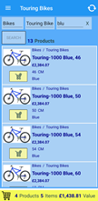
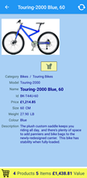
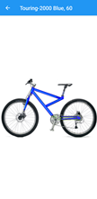
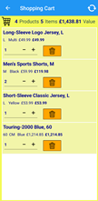
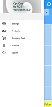

## PortableShop - Xamarin Forms

|||||||
|:---:|:---:|:---:|:---:|:---:|:---:|
|Splash|Overview|Details|Picture|Basket|Menu|

#### Summary
Working portable application for test and demo purpose. It simulates limited shopping capabilities based on the Microsoft AdventureWorks database.

#### News
* Version 1.0 is assumed to be a milestone as the last one on Xamarin Forms, before moving on to MAUI which is 2.0.
* Refresh Icon has been replaced.
* Cart deletion buttons now have icons.
* Cart became alphabetically sorted.
* Storage of filter has been corrected.
* Enablement of the products overview has been improved.
* Language can now be set independently of device.

#### Known issues
* Recovering from a service problem does not succeed.

#### Purpose
* Explore various techniques based on Xamarin Forms, XAML and C#.
* Manage the code and releases by Git and GitHub.
* Explore continuous integration by using combinations of Git, GitHub, Azure DevOps and TeamCity.
* Explore Scrum process management by integration with Jira and Azure DevOps.

#### Description
* This is a near equivalent of my **[WpfShop](https://github.com/a-einstein/WpfShop)**.
* Currently the Android application is only tested on API 30.
* Currently the UWP application is only tested on Windows 10 version 22H2.
* Connected to automated Azure Devops build and release pipelines. Current build status for its dedicated branch: 

#### Aspects
* Xamarin Forms.
* Xamarin Essentials.
* Xamarin Community Toolkit.
* .Net Standard.
* XAML + C#.
* MVVM.
* Dependency injection.
* Client-server + SSL.
* Asynchronisity.
* WCF or Web API.
* Has made use of an Azure service.
* Error handling.
* Globalized resources.
* Basic styling.
* Splash screen.
* Shell navigation including Fly out.
* Rotation.
* Custom controls.
* Extensions.
* Attached behaviours.
* Application icon (Android).
* MSIX installation.
* Azure DevOps self hosted build pipeline + release pipeline to either Azure or GitHub.

#### Prerequisites
* The application must be configured for a running instance of my **[AdventureWorks services](https://github.com/a-einstein/AdventureWorks/blob/master/README.md)**.

#### Installation
* The application is plug & play, but use of the data service is on request. Contact the developer ahead. 
* Installables are to be obtained from Assets of the latest available release in **[Releases](https://github.com/a-einstein/PortableShop/releases)**.

##### Android
* Download the latest APK file to your Android phone. 
* Install the aplication from the notification or the download folder. You probably have to suppress some warnings.
* In some cases one needs to 'Uninstall for all users' and repeat the install.
* Start the application. Either it will start 'empty' displaying a warning, or if the data service is running, one can 'shop' the contents.
* Uninstallation can be done by the normal Android procedure.
* Updating is currently not supported, but can be done manually after uninstalling. One can also use the option from the application's menu to get to the Release page.

##### UWP
* Download the latest ZIP file to your PC. 
* Extract if needed.
* If not already done, install the certificate by right clicking on the .cer file. Choose 'Local Machine' and select 'Trusted Root Certification Authorities' as store.
* Now install the application by double clicking the .msix or .msixbundle file. If selected, the application starts right away.
* Note that the application gets installed in the Windows 'Apps' menu, and will not show up in the 'Programs and Features' list.
* Both starting (left click) and uninstallation (right click) are from the 'Apps' menu.

